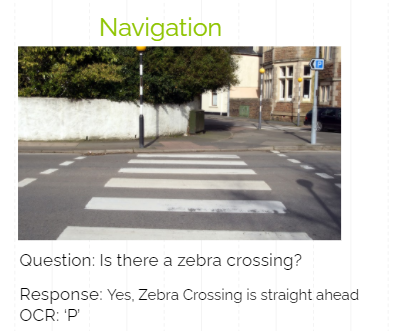

# T4SNE-Term-Project

This is a simple Demo of Visual Question answering, OCR and Speech To Text modules

## Model Architechture


## Requirements

For installing requirements run - 
```

pip install -r requirements.txt
pipwin install PyAudio

```
Download all folders from drive link given below and place them in the main directory, download VQA_MODEL_WEIGHTS.hdf5 and place in models/VQA  
drive link: https://drive.google.com/drive/folders/1P90Z_VXlViUfncVayeWcZ0kX7igrHOHn?usp=sharing

## Usage
To call your own model pass the argument -model and name of the file. For e.g

> python train -model DeeperLSTM

To run the demo

> python demo.py -module <select a module out of vqa, ocr, speech_to_text> -enable_text_to_speech  <set True to get speech output> -image_file_name <path_to_file> -question "Question to be asked"

e.g 

> python demo.py -module vqa -image_file_name test.jpg -question "Is there a man in the picture?"

## Use cases

  
  
  
